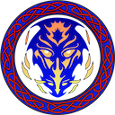
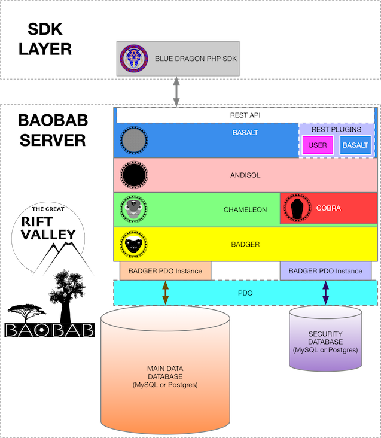

\mainpage BLUE DRAGON PHP SDK

THE GREAT RIFT VALLEY PLATFORM PHP SDK LIBRARY
==============================================

Part of the Rift Valley Platform
-----------------------------------------------------------------------------------------------------------------

INTRODUCTION
============
The BLUE DRAGON PHP SDK Layer is a general-purpose ORM for the BAOBAB Server. It uses the REST API to communicate with the Server, and presents the server as a PHP Object Model for use by PHP applications.

LICENSE
=======

© Copyright 2018, [Little Green Viper Software Development LLC](https://littlegreenviper.com).
This code is ENTIRELY proprietary and not to be reused, unless under specific, written license from [Little Green Viper Software Development LLC](https://littlegreenviper.com).
